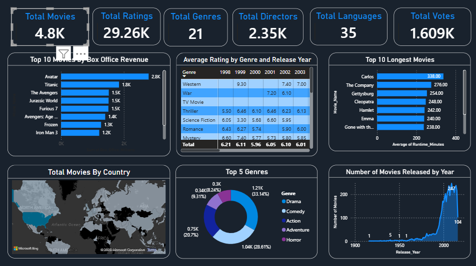

# 🎬 Movie Ratings Explorer | Power BI Dashboard

An interactive Power BI dashboard designed to explore movie ratings, box office performance, genres, release trends, and other key insights from a movie dataset.

---

## Project Overview

Movie Ratings Explorer is a beginner-friendly Power BI project that transforms raw movie data into interactive visualizations and meaningful insights. The dashboard enables users to analyze movie performance across genres, years, countries, and other attributes.

---

## 📷 Dashboard Preview



---

## 📊 Dashboard Features

### Key Performance Indicators (KPIs)

- 🎥 Total Movies
- ⭐ Total Ratings
- 🎭 Total Genres
- 🎬 Total Directors
- 🌐 Total Languages
- 👍 Total Votes

### Interactive Visualizations

- 📈 Top 10 Movies by Box Office Revenue
- ⭐ Average Rating by Genre and Release Year
- ⏱ Top 10 Longest Movies
- 🌍 Total Movies by Country
- 🍿 Top 5 Movie Genres
- 📅 Number of Movies Released by Year

---

## 🛠 Tools & Technologies

- Microsoft Power BI
- Power Query
- DAX
- Data Modeling

---

## 📂 Dataset

The dataset includes information such as:

- Movie Title
- Genre
- Director
- Release Year
- Runtime
- Rating
- Votes
- Box Office Revenue
- Country
- Language

---

## 📈 Key Insights

- Identified the highest-grossing movies.
- Analyzed average ratings across genres and release years.
- Explored global movie distribution by country.
- Compared the popularity of different movie genres.
- Visualized movie release trends over time.

---


## 📁 Project Structure

```
Movie-Ratings-Explorer/
│
├── Movie Ratings Explorer.pbix
├── movies_dataset.xlsx
├── README.md
└── images/
    └── Movie-Ratings-Explorer.png
```

---

## 🚀 Skills Demonstrated

- Data Cleaning
- Data Transformation
- Data Modeling
- DAX Measures
- Dashboard Design
- Data Visualization
- Business Intelligence
- Data Analysis

---

## 🔮 Future Enhancements

- Add interactive slicers for Genre, Country, and Language
- Create drill-through report pages
- Add custom tooltips
- Improve mobile layout
- Include advanced DAX measures

---

## 👨‍💻 Author

**Ganesh Bhargav**

If you found this project helpful, feel free to ⭐ the repository.
